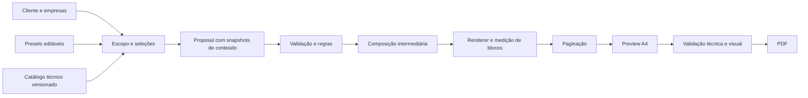

# Gerador EngMarq — Fundação V2

## Estado atual: assessoria configurável e documento paginado

As etapas posteriores à fundação estão implementadas:

- [Interface da equipe](V2-UI.md): cliente, escopo, comercial e revisão em
  `v2.html`, com rascunho em memória e preview ao vivo. O laboratório de fixtures
  anterior está preservado em `v2-preview.html`.

- [Assessoria e grupos](V2-ASSISTANCE.md): configuração comum e por empresa,
  quantidades individuais, condições comerciais e visibilidade explícita.
- [Documento e paginação](V2-PAGINATION.md): renderer DOM seguro, Paged.js,
  fluxo A4, preview, verificação geométrica e preparação para impressão/PDF.

O documento intermediário usa `compositionVersion: 3`. O núcleo continua puro;
as APIs de navegador são importadas diretamente de `renderer/` e `pagination/`.
A entrada `v2.html` é isolada. Apenas dependências e a lista de entradas Vite
foram ampliadas para disponibilizá-la; não houve conexão com banco ou migração
de telas, modelos ou templates V1.

O restante deste documento registra a auditoria e as decisões históricas da
fundação. Referências abaixo a etapas futuras/versão 2 do documento descrevem
aquele marco; os dois documentos acima são a especificação atual dessas camadas.

Data: 07/09/2026. Repositório: NataNS040/Fatasma040.

## Evolução: catálogo universal e composição técnica

A segunda etapa está descrita em [V2-CATALOG.md](V2-CATALOG.md), incluindo cadastro
de novos serviços e exemplos executáveis. O catálogo agora contém os 25 serviços
solicitados e a assessoria preexistente, com conteúdo editorial estruturado,
parâmetros e fontes. Há níveis `summary`, `standard` e `full`, presets
`kit-programas` e `kit-completo`, agrupamento por seções configuráveis e
compartilhamento de trechos idênticos com vínculos por item e empresa.

`ProposalDocument.compositionVersion: 2` identifica a nova estrutura:
`technical-section`/`shared-technical` substituem os blocos isolados `technical`.
O documento retém `sourceItems` completos; a apresentação usa apenas `blocks`.
Proposals anteriores sem `content.profile` continuam aceitas, com fallback de
apresentação. Não há mudança na versão da Proposal nem conexão com a V1.

Arquivos da evolução, além dos existentes na fundação:
`domain/content.ts`, `catalog/{types,shared,programs,management,measurements,trainings,select-service}.ts`,
`composer/{presentation-policy,technical-sections}.ts`, `validation/parameters.ts`,
`presets/catalog-presets.ts`, `scripts/{load-v2,v2-example}.mjs` e os JSONs em `examples/`.
Tipos, composer, validação, catálogo, fixture e testes V2 foram ampliados.

## Decisão e limite desta entrega

A V2 é um módulo TypeScript independente em `src/v2`. Recebe uma `Proposal`
tipada e produz um `ProposalDocument` serializável, com blocos semânticos e
valores por empresa. Não depende de DOM, autenticação, banco, Supabase, rede,
storage ou templates V1. Nenhuma tela ou rota existente importa a V2.

Esta entrega termina na composição intermediária. Renderer HTML, paginação real,
preview A4, validação visual e exportação PDF ainda não estão implementados.
Os contratos de paginação e tokens visuais preparam essas etapas sem simulá-las.
O documento tem `stage: 'composed'`, não um estado de aprovação ou de PDF pronto.

## Auditoria da V1

Foi inventariada a pasta `gerador`: entradas HTML, TypeScript, templates, tipos,
configurações, estilos, scripts auxiliares, assets e configuração de build.
Arquivos compilados em `assets` não são tratados como fonte para a V2.

| Área | Situação observada | Consequência |
| --- | --- | --- |
| `src/main.ts` (957 linhas) | Autenticação, DOM, dados, cálculos, eventos, catálogo de treinamentos, entregáveis e preview no mesmo arquivo | Mudanças técnicas afetam o formulário; testes exigem navegador |
| `src/generators/gerador-proposta.ts` | Switch por tipo, desvios por `modeloId` e template especial; monta HTML, CSS, scripts e impressão | Combinações dependem de novas ramificações |
| `src/templates/` | Capa, identificação, escopo, investimento, aceite e rodapé repetidos; páginas e números manuais | Conteúdo e paginação acoplados, divergências entre famílias |
| `src/config/modelos-prontos.ts` | Bom início de catálogo com fontes, mas mistura serviços, combos, campos de UI, preços e seleção de template legado | Preset ainda controla documento e interface |
| `src/types/proposta.types.ts` | `DadosCliente`/`DadosTemplate` achatados, muitas opções e quantidades em strings; sem itens técnicos ligados por ID ao CNPJ | Difícil representar treinamentos e medições individualizados em grupos |
| `src/styles/proposta-styles.ts` | A4 com altura fixa e `overflow: hidden`; ajustes locais para investimento e rodapé absoluto | Conteúdo longo pode ser cortado sem diagnóstico |
| `index.html` | Carrega `src/main.ts`; handlers globais e preview da capa | Preview não verifica o documento integral |
| `assessoria.html` (cerca de 2 mil linhas) | Fluxo próprio em JavaScript inline; catálogo, formulário e geração de HTML independentes | Há dois motores de assessoria a considerar na migração |
| `personalizada.html`, contratos, recibos, calculadora e orçamento | Fluxos próprios; parte dos scripts em JS e com localStorage | Não ampliar o escopo da V2 para essas telas nesta fase |
| `src/auth`, `src/lib`, `supabase/` | Integração Supabase já existente na V1 | Preservada, sem uso ou expansão na V2 |
| Raiz e `gerador/` | Dois pacotes, tsconfigs e configurações Vite; a raiz compila outro `src/` | Executar comandos no pacote correto e registrar falhas separadamente |

A V1 também interpola valores em HTML e scripts sem escape central uniforme.
A V2 mantém texto literal; o futuro renderer deverá criar nós seguros ou escapar
texto e atributos conforme contexto. O motor atual não executa HTML recebido.

## Evidências das propostas reais

Inventário de agosto/2026 inclui TM0122 a TM0138, propostas agrupadas e documentos
auxiliares. Os HTMLs foram usados como fontes de conteúdo e estrutura; o PDF
TM0137 também existe em `propostas-pdf/agosto-2026`. Esta fase não é uma comparação
visual automatizada dos PDFs.

| Fonte (a partir da raiz do repositório) | Padrão a preservar |
| --- | --- |
| `propostas/agosto-2026/TM0136-Condominio Villaggio Di Roma.html` | Assessoria de empresa única, programas, psicossocial, treinamentos com públicos diferentes, mensalidade, vigência; avaliações qualitativas incluídas e quantitativas excluídas |
| `propostas/agosto-2026/TM0137-Grupo Bertis.html` | Cinco CNPJs; escopo comum com execução individual; 17/22/8/9/23 colaboradores, brigada 10/10/8/9/10; uma medição de calor por empresa e investimentos mensais individuais |
| `propostas/maio-2026/proposta-pgr-pcmso-ltcat-atecmontagem.html` | Kit para duas empresas; documentos separados por CNPJ; integração PGR/PCMSO/LTCAT; medições quantitativas contratadas à parte |
| `propostas/maio-2026/proposta-programas-medicoes-unimetais.html` | Programas com medições discriminadas: ruído, calor, vibração e agentes químicos; pontos e amostras distintos; psicossocial fora do valor global |
| `propostas/maio-2026/proposta-brigada-incendio-ceneged.html` | Conteúdo teórico/prático, carga horária, participantes, turma, certificação digital, materiais e área prática sob responsabilidade da contratante |
| `propostas/maio-2026/proposta-treinamentos-psicossocial-imperthane.html` | Combinação psicossocial + NR-18 + NR-35; modalidade, alunos, investimento por item, entregáveis e condições de execução |

Conteúdo técnico preservável: objetivo, metodologia, entregáveis, referências,
responsabilidades, exclusões, população atendida, quantitativos, modalidade,
vigência, execução, pagamento, autoria e aceite. Inclusão de PGR/PCMSO/LTCAT
não implica contratação automática de medições, ART, eSocial ou treinamentos.
Esses serviços devem ser seleções explícitas; `custom` permite os itens ainda
não catalogados. As fixtures são fictícias e parciais, não réplicas comerciais
de TM0136/TM0137 (não incluem automaticamente ART ou eSocial).

Identidade visual: logo existente, azul `#1a365d`, dourado `#f5a623`, Montserrat
nos títulos e Open Sans no corpo; acentos verde para assessoria, roxo para
psicossocial e laranja para treinamentos; capa institucional, seções numeradas,
quadros de entregáveis, tabelas de investimento, cabeçalho, rodapé e aceite.
`renderer/theme.ts` registra esses tokens. O caminho de logo é uma referência
de origem, não uma URL pronta para deploy.

## Arquitetura e fluxo



Até F implementado. G a K são etapas futuras. O renderer medirá conteúdo com
fontes e imagens carregadas; paginação usará geometria real e blocos/fragments,
não contagem de caracteres nem cortes com `overflow: hidden`.

| Camada | Responsabilidade e dependências |
| --- | --- |
| `domain/` | Proposal e documento intermediário. Sem UI ou infraestrutura |
| `catalog/` | Conteúdo técnico reutilizável, com fonte, revisão e estado de revisão; retorna cópias independentes |
| `presets/` | Atalhos que criam seleções editáveis; não escolhem HTML, preço ou páginas |
| `validation/` | Invariantes de dados, referências, valores e avisos técnicos; depende do domínio e utilitários |
| `composer/` | Função pura que valida, copia dados, organiza blocos e calcula valores; não calcula páginas |
| `renderer/` | Nesta fase tokens; futuramente converte blocos em componentes visuais e mede dimensões |
| `pagination/` | Nesta fase contratos; futuramente quebra blocos, repete cabeçalhos de tabela e relata overflow |
| `components/` | Reserva documentada para componentes de documento, sem regras comerciais |
| `ui/` | Reserva documentada para edição e preview; adapta entradas ao domínio |
| `fixtures/` | Exemplos fictícios de empresa única e grupo misto de cinco empresas |
| `utils/` | Datas civis e validação numérica sem acesso externo |

Não há container de injeção, classes de repositório, ORM, event bus ou framework
adicional. A API pública está em `src/v2/index.ts`.

## Contrato de dados e invariantes

- `schemaVersion: 2`, metadata com revisão e data civil explícitas. Sem gerar IDs
  ou datas pelo relógio dentro do motor.
- Cliente é o destinatário comercial (empresa ou grupo); `companies[]` mantém
  entidades atendidas. Uma empresa exige exatamente um cadastro; grupo, ao menos dois.
- IDs de empresas únicos; IDs de itens únicos entre todas as coleções.
- `services[]`, `trainings[]`, `measurements[]` e `assistance[]` coexistem.
  Cada item aponta para uma empresa; escopo comum é expandido em instâncias.
  Assessoria é uma coleção para permitir vigências e rotinas por empresa.
- Conteúdo técnico é um snapshot na Proposal. Alterar o catálogo amanhã não
  altera uma proposta já composta. Não se herda texto de um template V1.
- Treinamento tem modalidade única, participantes, turmas, horas por turma,
  ocorrências contratadas e conteúdo programático. Recorrência não é inferida de norma.
- Medição tem agente, método, quantidade, unidade e grupos de trabalho.
- Psicossocial tem participantes, instrumentos e integração dos resultados.
- Cada item tem exatamente uma linha comercial: cobrança explícita em centavos
  inteiros ou inclusão vinculada diretamente a uma cobrança da mesma empresa.
  Inclusão não é somada novamente; cadeias/ciclos de inclusão são rejeitados.
- Valores são totais contratados por item e cadência, não preços unitários.
  Quantidade técnica não multiplica preço automaticamente.
- Totais únicos e mensais são separados globalmente e por empresa. Não há
  soma ambígua nem projeção de valor contratual com prazo presumido.
- Erros impedem composição; avisos de revisão técnica permitem preparar um
  rascunho, mas não significam autorização de publicação ou conformidade legal.

`validateProposal` recebe uma Proposal tipada: não é parser de JSON arbitrário.
Importação local de arquivos deverá ganhar validação estrutural de `unknown`
antes de chamar esta API; não usar `JSON.parse(...) as Proposal` na futura UI.
Validação de CNPJ, consistência de cláusulas em texto livre, descontos,
parcelamentos estruturados e aprovação editorial ficam para fases específicas.

## Uso local

```ts
import { composeProposal } from './src/v2';
import { mixedGroupProposal } from './src/v2/fixtures/proposals';

const result = composeProposal(mixedGroupProposal());
if (result.ok) {
    console.log(result.document.blocks); // dados, não HTML
} else {
    console.error(result.issues); // code, path, severity e message
}
```

Comandos a partir da raiz:

```sh
node --test gerador/tests/v2.test.mjs
npm run type-check --prefix gerador
npm run build --prefix gerador
```

Os testes usam Node Test Runner e TypeScript já instalado, compilando a V2 em
diretório temporário. Não adicionam dependências nem alteram scripts V1.
O build do gerador verifica os tipos da V2, mas o Vite não a inclui nos bundles
V1 porque nenhuma entrada a importa. O teste compila e executa o motor isoladamente.

## Migração e regras de preservação

1. Manter todas as entradas, templates, estilos, assets, autenticação e contratos
   públicos da V1. Não conectar a V2 a `main.ts` nesta fase.
2. Ampliar catálogo e fixtures gradualmente; revisar conteúdo com a equipe técnica.
   Não transportar preços, prazos e promessas de clientes reais como defaults globais.
3. Implementar renderer e paginação sob entrada V2 separada, com assets locais.
   Preview e PDF devem usar o mesmo documento paginado.
4. Testar nomes/endereço longos, muitas empresas, tabelas extensas, conteúdo
   customizado, textos escapados, fontes offline e detecção de overflow.
5. Comparar propostas representativas com a V1 e fontes reais. Validar ausência
   de perda de escopo, números e assinaturas, além de revisão visual A4.
6. Só migrar acesso do usuário depois de validação funcional/técnica/visual;
   manter caminho V1 e rollback simples durante a transição.

Nenhum banco, integração Supabase nova, envio externo ou publicação nesta entrega.
Não alterar propostas históricas nem arquivos de trabalho preexistentes.

## Dívidas encontradas e limites conhecidos

- TM0136 diz todos os treinamentos online em alguns trechos e EAD ou presencial
  em outros. A modalidade deverá ter fonte única; não copiar ambas as cláusulas.
- Fontes históricas contêm afirmações de obrigatoriedade, validade EAD e referências
  normativas que exigem revisão técnica. Catálogo inicial está todo `pending`;
  esta auditoria é do repositório, não uma atualização jurídica/normativa.
- Dependências externas de Google Fonts e Font Awesome na V1 impedem garantir
  fidelidade offline. A V2 deverá distribuir fontes e ícones locais quando renderizar.
- Paginação fixa pode ocultar conteúdo; ainda não há teste visual/PDF nesta fundação.
- O build V1 já avisa que `orcamento.html` usa `orcamento.js` sem `type="module"`.
  O aviso não foi criado pela V2 e não foi corrigido alterando a V1.
- O pacote da raiz tem falhas preexistentes de typecheck por import não utilizado
  `formatData` em `src/templates/template-plataforma.ts` e
  `src/templates/template-psicossocial.ts`. O pacote `gerador/` é independente e
  seus comandos de typecheck/build passam. Não alterar essa outra V1 nesta entrega.
- O catálogo universal já cobre químicos, poeiras, vibração e os dez treinamentos
  solicitados. A revisão técnica dos conteúdos e condições de execução segue pendente.
- Validação semântica não detecta contradições arbitrárias em texto livre;
  não há parser de importação, workflow de aprovação, paginação ou PDF ainda.
- APIs validam referências entre itens, mas não verificam autenticidade de
  informações cadastrais ou habilitação profissional.

## Arquivos adicionados

Verificação desta entrega: 21 testes passaram; typecheck e build de `gerador/`
passaram. O build precisou de execução com permissão ampliada devido à restrição
de leitura do ambiente ao carregar o Vite. Os SHA-256 de `dist/index.html`,
`dist/assessoria.html` e do bundle principal V1 permaneceram idênticos ao build
anterior à implementação. `git diff` confirmou ausência de mudanças em arquivos
preexistentes. Não foi realizado teste manual de todas as telas V1.

Todos os caminhos abaixo são relativos a `gerador/`. Nenhum arquivo existente
foi alterado para conectar ou acomodar a V2.

```text
V2-ARCHITECTURE.md
src/v2/index.ts
src/v2/domain/proposal.ts
src/v2/domain/document.ts
src/v2/catalog/services.ts
src/v2/presets/program-kit.ts
src/v2/composer/compose-proposal.ts
src/v2/validation/proposal.ts
src/v2/utils/value.ts
src/v2/renderer/theme.ts
src/v2/pagination/contracts.ts
src/v2/components/README.md
src/v2/ui/README.md
src/v2/fixtures/proposals.ts
tests/v2.test.mjs
```
