# Gerador EngMarq - Arquitetura V2

Atualizado em 07/09/2026, na auditoria anterior à persistência.

## Estado e limites

A V2 possui editor em quatro etapas, catálogo universal, presets, assessoria
configurável, grupos, composição técnica/comercial, renderer DOM, paginação A4,
preview e preparação para PDF pelo diálogo de impressão. **Não possui banco,
persistência, autenticação própria nem conexão Supabase.**

Código funcional V1 permanece separado: `src/main.ts`, templates, geradores,
autenticação, integrações existentes e entradas HTML não foram migrados. A V2
tem entrada própria, `v2.html`. Build e algumas dependências são compartilhados;
atualizar ferramentas exige verificar também a preservação da V1.

Documentação complementar:

- [Guia da equipe](V2-USER-GUIDE.md) e [guia do desenvolvedor](V2-DEVELOPER-GUIDE.md).
- [Migração e fontes reais](V2-MIGRATION.md).
- [Catálogo](V2-CATALOG.md), [assessoria](V2-ASSISTANCE.md) e [paginação](V2-PAGINATION.md).
- [Qualidade](V2-QUALITY.md) e [auditoria de prontidão](V2-AUDIT.md).

## Fluxo executável

```mermaid
flowchart LR
    Catalog[Catálogo e presets] --> Draft[Rascunho do editor]
    Draft --> Proposal[Proposal tipada]
    Proposal --> Config[Resolver assessoria]
    Config --> Validate[Validação semântica]
    Validate --> Composer[Composição pura]
    Composer --> Document[ProposalDocument]
    Document --> Renderer[DOM seguro]
    Renderer --> Assets[Fontes e imagens locais]
    Assets --> Paginator[Paged.js serial]
    Paginator --> Inspect[Geometria e integridade]
    Inspect --> Preview[Preview A4]
    Preview --> Print[Preparar novamente e imprimir]
```



Todos esses estágios estão implementados. `Proposal.schemaVersion` é 2;
`ProposalDocument.compositionVersion` é 3 e seu `stage` continua `composed`.
Composto não significa aprovado nem pronto para imprimir. Somente
`ExportPreparation.ready` considera a paginação real. Revisão técnica humana
continua necessária, mesmo com `ready: true`.

## Camadas

| Diretório em `src/v2` | Responsabilidade |
| --- | --- |
| `domain` | Proposal, empresas, itens, parâmetros, assessoria e blocos semânticos |
| `catalog` | 27 serviços com conteúdo estruturado, parâmetros, fontes e revisão |
| `presets` | Seleções editáveis, aliases V1 e inventário de migração; sem preços ou HTML |
| `configurator` | Herança e sobrescritas por empresa; materialização de assessoria |
| `validation` | Parâmetros, vínculos, números, cobranças, erros e avisos |
| `composer` | Ordenação, detalhe, deduplicação, planejamento e investimento |
| `components` | Elementos, seções, listas e tabelas DOM seguras |
| `renderer` | Apresentação dos blocos e CSS A4, sem calcular preços ou páginas |
| `pagination` | Assets, fila Paged.js, inspeção e decisão de exportação |
| `ui` | Rascunho, formulário, navegação, preview e laboratório |
| `fixtures` | Exemplos determinísticos e dez cenários empresariais de regressão |
| `utils` | Datas civis e operações numéricas locais |

`index.ts` exporta o núcleo puro e contratos públicos. UI, renderer DOM e motor
de paginação são importados por seus módulos, não pela API pura. O teste de
arquitetura analisa imports TypeScript: não há ciclos de execução, módulos
executáveis órfãos ou imports V1/Supabase no núcleo. Referências apenas de tipos
entre validação, configurador e investimento não criam ciclos em runtime.

Não existe template HTML central por tipo de proposta. O renderer usa blocos
semânticos e componentes comuns; o catálogo guarda dados, não scripts ou páginas.
Não há framework novo, ORM, event bus ou repositórios simulados. Contratos
históricos de `pagination/contracts.ts` e tokens de `renderer/theme.ts` continuam
exportados por compatibilidade: não são o motor atual nem código morto a remover.

## Contratos e invariantes

- Empresa única exige um cadastro; grupo exige pelo menos dois e identidade consistente.
- Empresas e itens têm IDs únicos. Cada item aponta para empresa da proposta.
- Serviços, treinamentos, medições e assessorias coexistem com quantidades individuais.
- O catálogo materializa snapshots independentes. Mudanças editoriais futuras não reescrevem propostas já compostas.
- Assessoria aceita configuração canônica ou itens materializados, nunca ambas.
- Configuração individual sobrescreve a comum; listas são substituídas e parâmetros mesclados. Visitas substituem o plano inteiro.
- Treinamentos preservam participantes, turmas, horas, ocorrências, modalidade, frequência e público, inclusive em assessoria.
- Quantidades e parcelas não multiplicam automaticamente preços. Valores são centavos inteiros seguros.
- Cada item tem cobrança ou inclusão direta em cobrança da mesma empresa; ciclos de inclusão são rejeitados.
- Valor único, mensalidade, vigência, parcelas e projeção contratual são conceitos separados.
- `showContractTotal=false` e `showAggregateTotal=false` evitam projeções, não apenas escondem texto.
- Renderer usa valores projetados de `blocks`, nunca preços brutos de `sourceItems`.
- `summary`, `standard` e `full` não alteram snapshots/preços; `compact`, `standard` e `consultive` organizam a apresentação.
- Deduplicação preserva campo e aplicabilidade; quantidades e textos divergentes não são fundidos.

`validateProposal` recebe Proposal tipada; não é parser de JSON arbitrário.
O adaptador de rascunho trata strings incompletas e conserva mensagens por etapa.
Futuras entradas externas precisam validar `unknown` antes do núcleo;
`JSON.parse(...) as Proposal` não valida importação.

## Estado e desempenho

Alterações bloqueiam o PDF imediatamente e invalidam trabalhos pendentes.
A digitação aguarda 550 ms antes da preparação; não compõe o documento por tecla.
A validação é reutilizada por revisão. Mudanças estruturais redesenham o formulário;
trocar de etapa não dispara nova paginação.

`DocumentPaginator` serializa operações no mesmo DOM. Solicitações superadas
são descartadas antes de iniciar ou após aguardar assets. Uma paginação já em
execução termina, mas não libera resultado obsoleto. Revisão de dados e identificador
de preparação protegem o editor de respostas antigas e cliques repetidos.
`superseded` significa descarte, não erro de conteúdo nem documento exportável.

Preview mobile oculto é medido fora da tela durante preparação. A escala visual
é aplicada depois da inspeção A4. Paged.js ainda usa o thread principal; ensaios
de digitação e documentos de até 21 páginas não são SLA para dispositivos lentos
ou escopos ilimitados.

## PDF e layout

Fontes Montserrat/Open Sans e logo são locais, aguardados antes/depois da paginação.
Cabeçalho/rodapé são elementos running, com contadores; tabelas têm cabeçalhos
semânticos repetíveis. Linhas, quadros atômicos e assinaturas não devem ser partidos.
Serviços longos podem continuar legitimamente em outra página.

A inspeção verifica overflow, tabela larga, conteúdo cortado, fragmentação atômica,
página vazia/invisível, rodapé invadido e integridade dos fragmentos de texto.
Página intermediária pouco ocupada gera aviso; página final de assinaturas pode
ter espaço livre. Erros impedem exportação. O botão refaz a preparação antes de
imprimir; Ctrl+P fora do fluxo não é controlável pela aplicação.

## Segurança e operação

Texto do cliente vira `textContent`, nunca HTML executável. Testes incluem strings
semelhantes a HTML, ausência de requisições externas e análise estática de sinks,
logs, `any` e padrões comuns de segredos. Isso não equivale a pentest nem a uma
varredura completa de segredos do repositório.

Não há autenticação fake nem uso implícito da sessão V1. A rota V2 não é protegida
por login. Não apresentar uma implantação pública como sistema autenticado.
Rascunhos vivem na memória da aba. `beforeunload` reduz perda acidental, mas não
salva nem recupera dados após falha/encerramento forçado. PDF não é formato de
edição/importação. Persistência e Supabase são o próximo projeto.

Quality Lab é apenas dev: `v2-quality-lab.html` não entra no build, seu módulo
exige `import.meta.env.DEV`, e a suíte verifica ausência em produção.
`v2-preview.html` permanece uma entrada de exemplos, não o editor da equipe.

O npm audit ainda aponta Vite/esbuild de desenvolvimento; ver `V2-AUDIT.md`.
Não publicar `vite dev` nem expô-lo à rede. Atualização principal dessas ferramentas
exige homologação compartilhada com V1. `dist` não executa servidor Vite,
mas também não ganha autenticação V2 automaticamente.

## Verificação e evolução

```sh
npm run test:v2 --prefix gerador
npm run type-check --prefix gerador
npm run build --prefix gerador
npm run dev:v2 --prefix gerador -- --host 127.0.0.1
```

A suíte cobre Node Test Runner, arquitetura, Playwright, HTMLs autônomos, PDFs,
regressão estrutural e isolamento de produção. Referências não são atualizadas
durante teste normal. Resultados em `artifacts/v2-suite/results.json`.

Permanecem pendentes aprovação editorial/normativa, persistência, parser externo,
workflow de aprovação e homologação de outros navegadores. Sete modelos V1
especializados continuam pendentes em `V2-MIGRATION.md`. Não alterar a V1
nem conectar Supabase incidentalmente ao ampliar a V2.